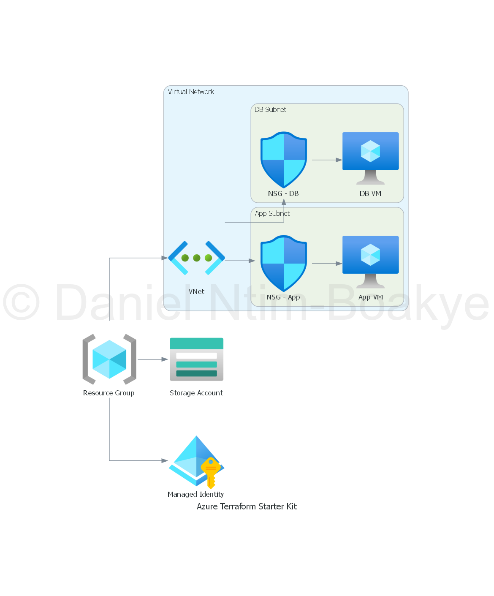

# Example Module

This module provides an example of how to structure a Terraform module for Azure resources. It is designed to be reusable and configurable for different environments.

## Purpose

The example module serves as a template for creating Azure resources. It can be customized by providing different input variables and can output relevant information about the resources created.

## Usage

To use this module, include it in your Terraform configuration as follows:

```hcl
module "example" {
  source = "../modules/example-module"

  # Add your variable assignments here
}
```

## Inputs

| Name        | Description                       | Type   | Default | Required |
|-------------|-----------------------------------|--------|---------|:--------:|
| example_var | An example input variable         | string | ""      | yes      |

## Outputs

| Name          | Description                       |
|---------------|-----------------------------------|
| example_output| An example output variable        |

## Example

Here is an example of how to call this module:

```hcl
module "example" {
  source      = "../modules/example-module"
  example_var = "value"
}
```

## Architecture Diagram

Below is the architecture diagram for the Azure Terraform Starter Kit:



## Notes

- Ensure that you have the necessary permissions to create resources in your Azure account.
- Review the variables and outputs to understand how to customize the module for your needs.